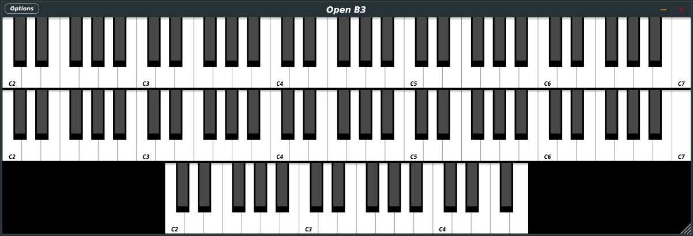

# Open B3: an open source tonewheel organ and rotary speaker emulator



## Summary
### [1. What is Open B3?](#what-is-open-piano)
### [2. How do I use it?](#how-do-i-use-it)
### [3. Building](#building)
### [4. Current state and road map](#current-state-and-road-map)
### [5. Can I contribute to this project?](#can-i-contribute-to-this-project)
### [6. Are you crazy?](#are-you-crazy)


## What is Open B3?
Open B3 is the younger brother of [setBfree](https://github.com/pantherb/setBfree):
> a MIDI-controlled, software synthesizer designed to imitate the sound and properties of the electromechanical organs and sound modification devices that brought world-wide fame to the names and products of Laurens Hammond and Don Leslie.

Open B3 is based on [Beatrix](https://github.com/pantherb/setBfree/tree/master/src), the same synthesis engine that powers [setBfree](https://github.com/pantherb/setBfree).  
It comes in two forms:
1. A simple C++ wrapper around the Beatrix engine, which is written in C. This is done to make the usage of Beatrix more straightforward. It can be found in the [BeatrixCPP](./BeatrixCPP) folder.
2. A C++ JUCE plugin that is based on [BeatrixCPP](./BeatrixCPP). It can be found in the [OpenB3JUCE](./OpenB3JUCE) folder, and this is what most people will be looking for.

#### But *why* do we need Open B3, if there's already setBfree?
setBfree can be downloaded for every major desktop OS and architecture, including the latest M1 Macs, but:
- the standalone app relies on [JACK](https://jackaudio.org/)
- the plugin is available in LV2 format only

If you're wondering why is this an issue: people outside the GNU/Linux world rarely venture into installing JACK or using a DAW that supports LV2 plugins. Usually, they have no idea what these things are. This severely limits the potential user base of setBfree. With Open B3, I would like to give Beatrix and setBfree the audience it deserves, since a JUCE plugin can be compiled into
- all sorts of plugin formats (VST3, AAX, AU, ... and in the near future, even [LV2](https://github.com/juce-framework/JUCE/issues/123))
- standalone desktop apps that make use of the native audio system of each OS (ALSA, Windows Audio, CoreAudio, ...)
- and even Android/iOS apps!

## How do I use it?
A first binary release of Open B3 will be published once the C++ wrapper includes all the basic functionality of Beatrix and once the prototype of the JUCE user interface is completed. Until then, you can build Open B3 yourself (see #building).

## Building
To build Open B3, you will need CMake (version 3.15 or above), a C++ compiler (C++17 or above), and the latest version of the [JUCE](https://github.com/juce-framework/JUCE) library. Once you clone/download this repository, you need to clone/download a copy of JUCE inside it. You end up with this directory structure:

```
OpenB3
├── JUCE/
├── BeatrixCPP/
├   ├── Source/
├   └── CMakeLists.txt
└── OpenB3JUCE/
    ├── Source/
    └── CMakeLists.txt
```
* Windows/macOS/Linux: if you use a CMake-based IDE like CLion or QtCreator, use it to open `CMakeLists.txt` and proceed building from there.
* Windows only: download and install the latest [CMake installer](https://cmake.org/download/), [Visual Studio Community](https://visualstudio.microsoft.com/vs/community/) IDE, and the [Windows SDK](https://developer.microsoft.com/en-us/windows/downloads/windows-sdk/). Open CMake, point it to the source folder (OpenPianoJUCE or OpenPianoCore), and generate a VS project to be opened in Visual Studio.
* macOS only: download and install XCode from the App Store and the [CMake installer](https://cmake.org/download/). Use CMake to generate an XCode project.
* Linux/macOS and other UNIX/UNIX-based/UNIX-like operating systems: use the command line :wink:

## Current state and road map
Open B3 works, but the C++ wrapper doesn't expose all Beatrix's functionality yet. Right now, there's just three keyboards (upper&lower manual and pedalboard). Here's a short list of what needs to be done (it may change frequently):
* [x] ~~Fix sample rate setting~~ - Fixed [HERE](https://github.com/michele-perrone/OpenB3/commit/47b80a901304214211a673c8e0176784a26215e3), but maybe `SampleRateD` shouldn't be global
* [ ] Expose all sound parameters (vibrato, percussion, reverb, whirl, overdrive) - work in progress 
* [ ] Design and implement a fully resizable in JUCE - work in progress (https://github.com/michele-perrone/OpenB3/commit/00c491b5d28e581899a2c92ce6e37e20fbc08296)
* [ ] Expose/implement programs and program changes
* [ ] Expose/implement configuration file loading and saving

## Can I contribute to this project?
Once the project reaches a certain usability level, contributions will be welcome. It would be really nice if improvements upon the sound synthesis engine were also upstreamed into setBfree.

## Are you crazy?
Yes